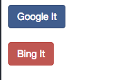

# Basic Scripting

## HTML

All websites are what are called 'HTML Documents'. An HTML Document is just a structured bit of content that works by wrapping content in contextual 'tags' that have certain semantic meanings.

For instance, a `<div>` tag is the most common tag. It's a 'division' of the page, or a box that contains some content.

A `<input>` tag is a form field that accepts user input. An `<a>` tag is a link to another page. A `<button>` tag performs some kind of action. A `<strong>` tag is presented in boldface, an `<em>` tag provides emphasis.

Here's a full HTML segment

```html
<div>
  <a href="https://www.google.com" id="google-link" class="btn btn-primary">Google it</a>
</div>
```

This is a div(box) that contains a link with the text Google it. It will look something like this:


Look at the a tag. It has several key-value pairs: href, id and class. href tells the link where to go when it's clicked. ID is a unique identifier for this element among all elements on the page (If properly coded, an ID is not repeated anywhere), and class is a set of categories to apply to this link. This is also the principal attribute by while HTML pages are *styled*. btn and btn-primary are two CSS classes which tell the browser to draw the link a certain way (As a *primary button*)

This is important because when scripting a browser to test, you will need to correctly identify which elements you want to interact with. You do this, primarily, via the use of 'selectors'

A class selector is prefixed with a period. So to select an element with a btn class you would use the selector `.btn`

For instance `find('.btn').click` would click the Google it link in our above example.

But consider the folliwng html:

```html
<div>
  <a href="https://google.com/" id="google-it" class="btn btn-primary">Google It</a>
</div>
<div>
  <a href="https://bing.com/" id="bing-it" class="btn btn-danger">Bing It</a>
</div>
```



Here there are two links, one for google and one for bing. Both have a btn class. This makes the previous `.btn` selector ambiguous (and as you'll find, computers require insane specificity to do anything correctly).

Therefore, in order to correctly click the google link, we need to be more specific. You can do this a couple of ways. One way is to provide a selector with more classes:

```
find('.btn.btn-primary').click
```

Another is to use an ID selector. As we pointed out earlier, IDs should be unique across the whole page.

```
find('#google-it').click
```


## Testing Google

Welcome to your first test script! In the test folder, you'll find a file called script.rb.

This is where you can put code to perform some useful instructions for the script to carry out.

To get started, by default, anything you do in this script will be in the context of the website https://google.com.

```
visit '/'
```

Will go to the google homepage.

Try it out. Type the above code into script.rb and run bin/start from your working directory.
